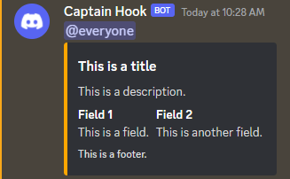

# PSDiscordWebHook

| PowerShell Gallery                                                                                                                                 | Issues                                                                                                                                            | License                                                                                                                                                          |
| -------------------------------------------------------------------------------------------------------------------------------------------------- | ------------------------------------------------------------------------------------------------------------------------------------------------- | ---------------------------------------------------------------------------------------------------------------------------------------------------------------- |
| [](https://www.powershellgallery.com/packages/PSDiscordWebHook) | [](https://github.com/ExpendaBubble/PSDiscordWebHook/issues) | [](https://github.com/ExpendaBubble/PSDiscordWebHook/blob/master/LICENSE) |

## PSDiscordWebHook Cmdlets

| Function Name                                                                | Synopsis                                                    |
| ---------------------------------------------------------------------------- | ----------------------------------------------------------- |
| [Edit-DiscordWebHookMessage](docs/Edit-DiscordWebHookMessage.md)             | Edits a Discord message that was created by the webhook.    |
| [Initialize-DiscordWebHookAuthor](docs/Initialize-DiscordWebHookAuthor.md)   | Creates a new Discord author object.                        |
| [Initialize-DiscordWebHookEmbed](docs/Initialize-DiscordWebHookEmbed.md)     | Constructs a Discord embed object for use within a message. |
| [Initialize-DiscordWebHookField](docs/Initialize-DiscordWebHookField.md)     | Creates a new Discord field object.                         |
| [Initialize-DiscordWebHookFooter](docs/Initialize-DiscordWebHookFooter.md)   | Creates a new Discord footer object.                        |
| [Initialize-DiscordWebHookImage](docs/Initialize-DiscordWebHookImage.md)     | Creates a new Discord image object.                         |
| [Initialize-DiscordWebHookMessage](docs/Initialize-DiscordWebHookMessage.md) | Constructs a message object to send to Discord via webhook. |
| [Remove-DiscordWebHookMessage](docs/Remove-DiscordWebHookMessage.md)         | Deletes a Discord message that was created by the webhook.  |
| [Send-DiscordWebHookMessage](docs/Send-DiscordWebHookMessage.md)             | Send a Discord message.                                     |

## Installation

The PSDiscordWebHook PowerShell Module is published to [PowerShell Gallery](https://www.powershellgallery.com/packages/PSDiscordWebHook).

```powershell
Install-Module -Name PSDiscordWebHook
```

## Description

A PowerShell module that makes it easy to send, edit and delete Discord messages via webhook.

## Setup

You will need a Discord webhook URL in order to use this module. You can only create webhooks for Discord servers that you own, and each channel you want to send to requires its own webhook. For more information on how to create a Discord webhook, see [Intro to Webhooks - Discord](https://support.discord.com/hc/en-us/articles/228383668-Intro-to-Webhooks).

## Usage

```powershell
Import-Module PSDiscordWebHook

$uri = 'https://discord.com/api/webhooks/xxxxxxxxxxxxxxxxxxx/xxxxxxxxxxxxxxxxxxxxxxxxxxxxxxxxxxxxxxxxxxxxxxxxxxxxxxxxxxxxxxxxxxxx'

$field1Name = 'Field 1'
$field1Text = 'This is a field.'

$field2Name = 'Field 2'
$field2Text = 'This is another field.'

$field1 = Initialize-DiscordWebHookField -Name $field1Name -Value $field1Text -Inline
$field2 = Initialize-DiscordWebHookField -Name $field2Name -Value $field2Text -Inline
$footer = Initialize-DiscordWebHookFooter -Text 'This is a footer.'
$embed = Initialize-DiscordWebHookEmbed -Title 'This is a title' -Description 'This is a description.' -Fields $field1,$field2 -Footer $footer -ColorName 'Orange'
$msg = Initialize-DiscordWebHookMessage -Embeds $embed -Content '@everyone'

$post = Send-DiscordWebHookMessage -Body $msg -Url $uri
```


